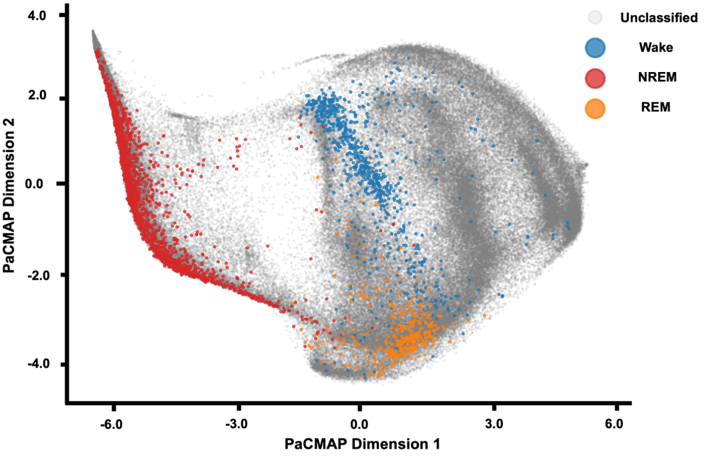

# Manifold Learning from High-dimensional Brain State Embeddings - BrainHack 2024

## Project Background

Thanks for checking this project out! Our lab collaborates with VUMC to collect intracranial EEG data from ~100 stereotactic EEG (SEEG) electrodes placed across the entire brain in patients with drug refractory epilepsy being evaluated in the epilepsy monitoring unit (EMU) prior to potential surgical intervention. These patients can remain in the EMU for up to 2 weeks, providing a rare opportunity to use SEEG data over an extended period of time to learn about not only seizure dynamics, but normal brain function.

However, whole-brain SEEG data proves to be very difficult to analyze due to complex, non-linear relationships in EEG activity between electrodes that evolve across multiple temporal scales. In an effort to interpret this data more effectively, our lab has developed a machine learning model that takes as input 10-second windows of whole-brain SEEG data and summarizes the patient's functional brain state during these 10 seconds as an 'embedding' in 1024-dimensional space. We thus call these 'brain state embeddings'. By feeding 10-second windows across the patient's entire EMU stay, we generate a 1024-dimensional point cloud where each point is a brain state embedding.

1024 dimensions is obviously difficult to analyze, so we employ Pairwise Controlled Manifold Approximation (PaCMAP) to project the data to a lower-dimensional manifold that can be more readily analyzed. PaCMAP is a manifold learning technique conceptually similar to UMAP that more effectively preserves both local and global structure during dimensionality reduction.

## Sleep Stages

There are many directions for this project, but we are first interested in validating the ability to discriminate between functionally distinct brain states using this point cloud. In other words, are functionally simdilar brain states closer to each other in the point cloud than functionally dissimilar brain states? Luckily, patients naturally cycle through a series of reliably dissimilar functional brain states: sleep stages!

To explore this, we used a sleep stage classifier on the raw SEEG data to generate metadata about periods of the EMU stay during which the patient was in REM, NREM, and wake. We can then tag the 2-dimensional manifold to visualize whether brain state embeddings from distinct sleep stages appropriately cluster apart from each other. Here is an example:

## Next Steps

As you can see, brain state embeddings across sleep stages appear to cluster appropriately. However, we are still looking for ways to quantify this analysis - and ultimately learn something about the underlying neural dynamics of sleep. 

Project directions...

# Getting started

1) Install Python and an IDE.
2) Create a virtual environment.
3) Activate virtual environment.
4) Fork repository to your local repository, then clone this repository locally:
- git clone [link]
5) Use the requirements.txt file to install all necessary packages and dependencies:
- pip3 install -r requirements.txt
6) Download the 1024-dimensional embeddings for 4 different patients as a .pkl file from this link:
7) Make sure this file is at directory source_pickles/raw_embeddings_1024d.pkl.
8) Create your own branch of this repository:
- git checkout -b [name of your branch]
9) Push any changes you make to your forked repo:
- git push -u origin [name of your branch]

# A Guide to This Repository

## create_manifold.py

This script takes the 1024-dimensional embeddings for a given patient and performs the manifold projection to 2 dimensions using PaCMAP. It will call functions from utils/unpickler.py to achieve this, but you won't ever need to interact with unpickler.py. 

Relevant command-line parameters:
- --patient_id: specify patient to run via an integer (choices are 30, ...).
- --all: provide instead of --patient_id to run all patients.
- --mn_ratio: mid-near pair ratio for PaCMAP. Increasing this value places more emphasis on preserving global structure. Default = 12.0.
- --fp_ratio: far-near pair ratio for PaCMAP. Increasing this value places more emphasis on separating clusters. Default = 1.0.
- --n_neighbors: number of neighbors considered for each point. Default = None, which prompts PaCMAP to automatically determine n_neighbors.
- --lr: learning rate for PaCMAP, controlling how much points are moved with each iteration. Default = 0.01.
- --do_10d: optional argument, if present will perform the usual 2D PaCMAP projection plus an additional 10D PaCMAP projection. This 10D PaCMAP projection is used for unsupervised clustering of the point cloud using HDBSCAN. These clusters are then visualized on the 2D point cloud. The intent here is to give the clustering algorithm access to a higher-dimensional version of the embeddings since information is likely lost at 2 dimensions. If this argument is not provided, no clustering technique will be performed on the 2D point cloud.

Output files:
- embeddings_Epat{ID}.pkl: 1024-dimensional embeddings for a given patient, reformatted from source_pickles file and tagged with some necessary DateTime metadata for later steps.
- manifold_Epat{ID}.pkl: 2-dimensional embeddings for a given patient along with necessary metadata.
- pointcloud_Epat{ID}.png: visualization of 2D point cloud. If --do_10d argument was provided, will visualize clusters generated by HDBSCAN on the 10D embeddings.

## sleep_tagger.py

This script takes the 2-dimensional embeddings for a given patient and tags them with corresponding sleep stage metadata.

Relevant command-line parameters:
- --patient_id: as an integer, same as for create_manifold.py

Output files:
- tagged_manifold_Epat{ID}.pkl: stores the tagged embeddings for a given patient.
- tagged_pointcloud_Epat{ID}.pkl: visualizes the tagged 2D embeddings.

